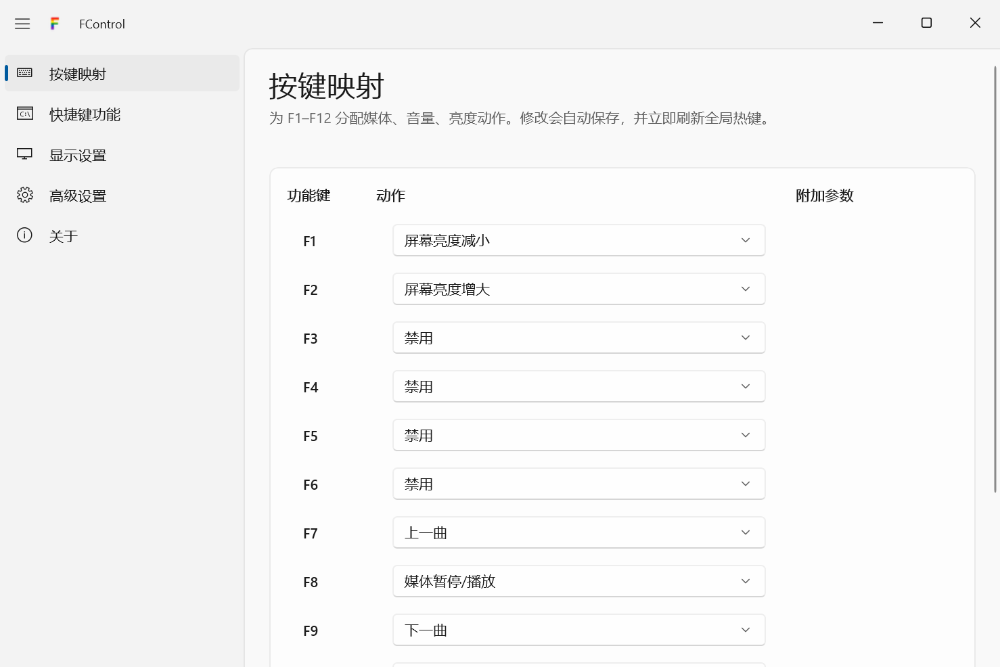
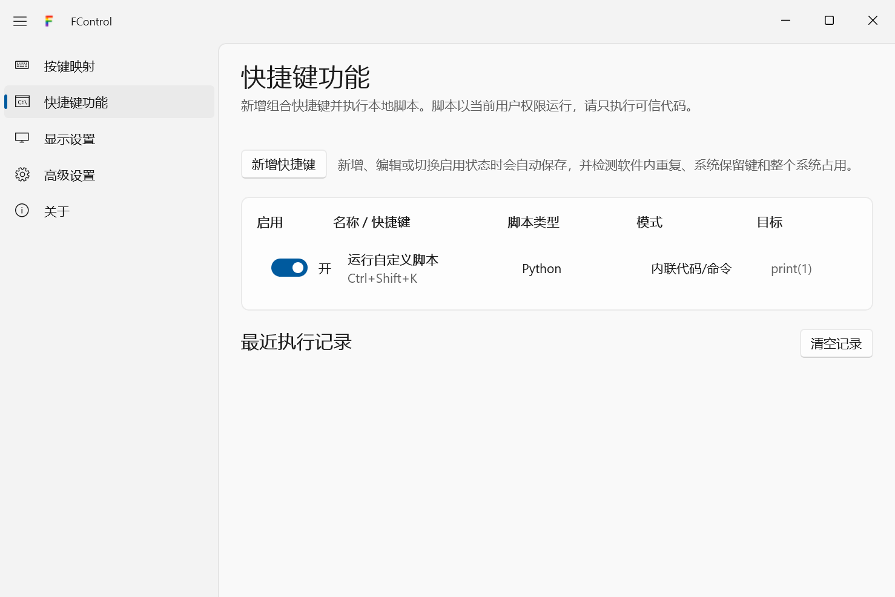
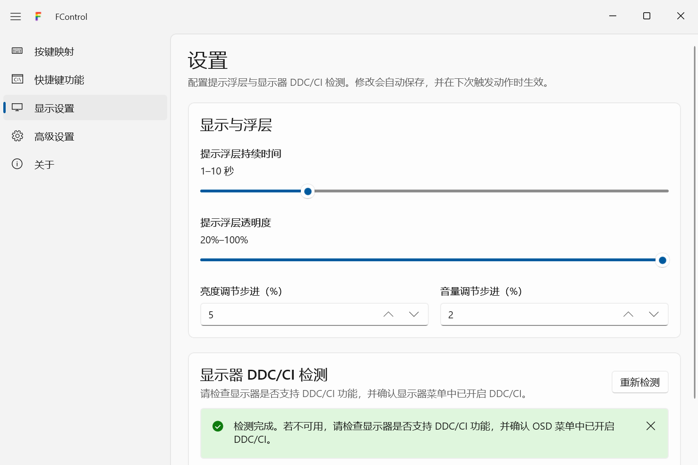
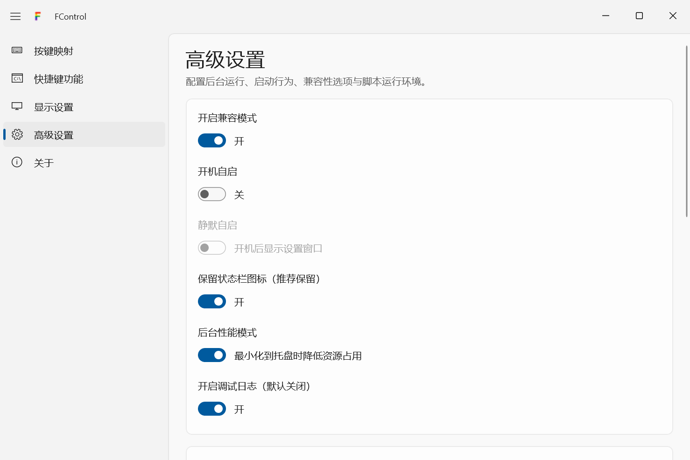
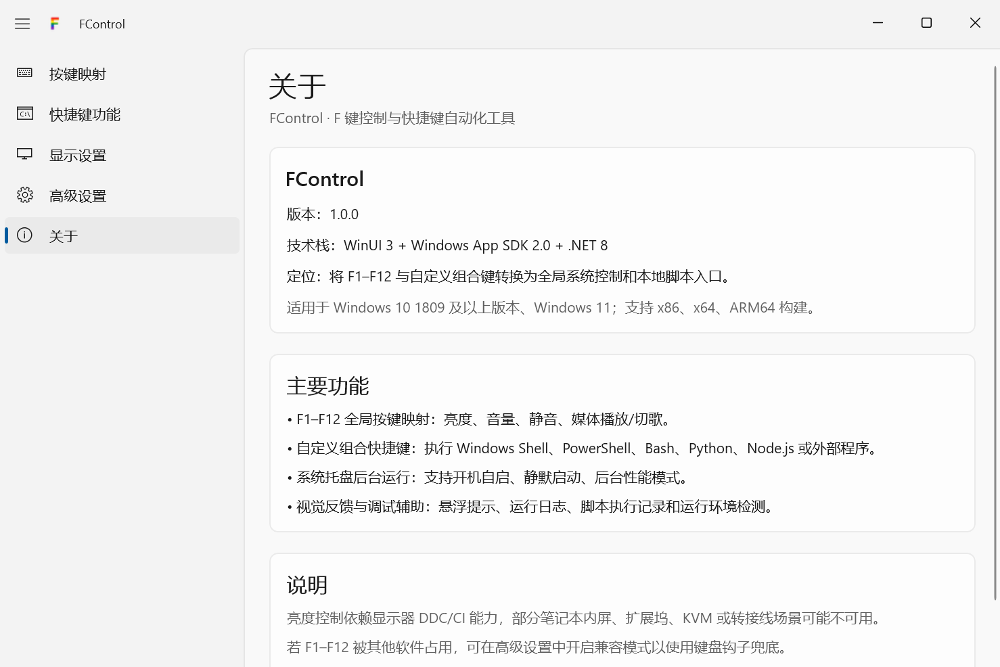
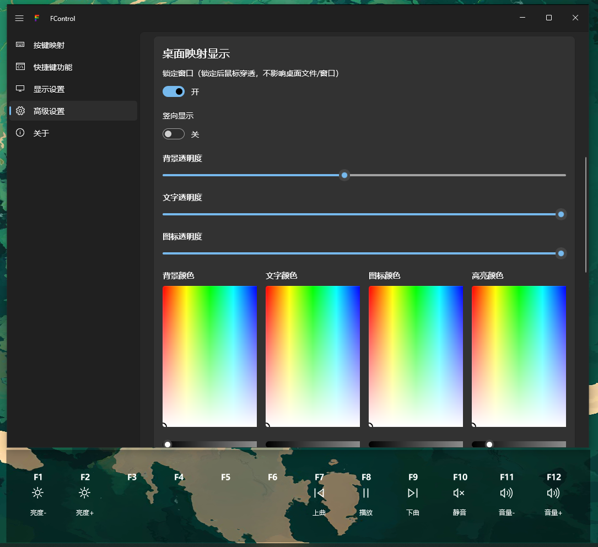

[中文版](README.md) | English

# FControl

> Transform F1–F12 and custom hotkeys into system controls and script launchers.

[](https://dotnet.microsoft.com/)
[](https://learn.microsoft.com/en-us/windows/apps/winui/)
[](https://learn.microsoft.com/en-us/windows/apps/windows-app-sdk/)
[](https://www.microsoft.com/windows)

## Overview

Many keyboards — especially compact or mechanical ones — lack dedicated media keys, forcing you to reach for the mouse just to adjust volume or skip a track. **FControl** repurposes your F1–F12 keys for system control and lets you bind custom hotkeys to run local scripts, all with real-time Fluent Design visual feedback.

### What it does

| Category | Actions |
| --- | --- |
| Brightness | Adjust external monitor brightness via DDC/CI (HDMI/DP) |
| Volume | Increase, decrease, mute toggle |
| Media | Play/pause, previous/next, stop, rewind/fast-forward |
| Scripts | Custom hotkeys → Shell / PowerShell / Bash / Python / Node.js / external programs |

## Screenshots








## Features

- **F1–F12 global hotkeys** — System-wide response from the background; each key is remappable
- **Custom combo hotkeys** — `Ctrl` / `Alt` / `Shift` / `Win` + any key to trigger scripts or commands
- **Script execution engine** — 6 script types: Windows Shell, PowerShell, Bash, Python, Node.js, external programs
- **Fluent Design overlay** — Semi-transparent overlay in the top-left corner with fade-in/fade-out animations for real-time feedback
- **System tray resident** — Minimizes to tray on close; quick-access tray menu
- **DDC/CI brightness control** — Directly controls supported external monitors with detection and troubleshooting guidance
- **Runtime detection** — Auto-detects Python, Node.js paths and versions, with manual override
- **Conflict detection** — Validates hotkeys for duplicates, system-reserved combos, and other app conflicts on save
- **Dark mode** — Full light/dark theme support with system accent color
- **Desktop key mapping overlay** — Displays F1–F12 mapping status as a floating desktop widget with key-press highlight feedback. Supports horizontal/vertical layout, custom colors & transparency, and window locking (click-through)

## Quick Start

### Requirements

- Windows 10 version 1809 (Build 17763) or later
- Windows 11 (all versions)
- x64, x86 architectures (ARM64 optional)

### Install

Download the `FControl-*-Setup.exe` matching your system architecture from the [Releases](https://github.com/biubiutata/fcontrol/releases) page and follow the setup wizard. The installer lets you choose the target drive and installation directory.

### Build

```bash
# Clone the repo
git clone https://github.com/biubiutata/fcontrol.git
cd fcontrol

# Build
dotnet build FControl.sln

# Run in debug mode
dotnet run --project FControl.csproj

# Publish for release (ReadyToRun; do not enable trimming for WinUI/XAML)
dotnet publish -c Release -r win-x64

# Build x64 / x86 / ARM64 regular EXE installers (requires Inno Setup 6)
winget install --id JRSoftware.InnoSetup -e
powershell -ExecutionPolicy Bypass -File scripts/build-installer.ps1
```

## Default Key Mappings

| Key | Action | Notes |
| --- | --- | --- |
| F1 | Brightness down | 5% step |
| F2 | Brightness up | 5% step |
| F3 – F6 | Disabled | Customizable |
| F7 | Previous track | |
| F8 | Play/pause | Toggle |
| F9 | Next track | |
| F10 | Mute toggle | On/off |
| F11 | Volume down | 2% step |
| F12 | Volume up | 2% step |

All keys are remappable in the Key Mapping page. Available actions: brightness, volume, mute, media (play/pause, previous/next, stop, rewind/fast-forward), disabled.

## Project Structure

```
FControl/
├── FControl.csproj              # Project file (WinUI 3 + .NET 8)
├── App.xaml(.cs)                # App entry & lifecycle
├── MainWindow.xaml(.cs)         # Main window (NavigationView)
├── ActionOverlayWindow.xaml(.cs)   # Overlay feedback window
├── DesktopKeyMappingWindow.xaml(.cs)  # Desktop mapping overlay
├── CustomHotkeyEditorWindow.xaml(.cs)  # Hotkey editor window
├── Models/
│   ├── AppConfiguration.cs      # Config model, defaults, metadata
│   └── HotKeyAction.cs          # Action enum & metadata
├── Services/
│   ├── AppConfigurationService.cs   # Config persistence (JSON)
│   ├── GlobalHotKeyService.cs       # Global hotkey registration / keyboard hook
│   ├── HotKeyActionService.cs       # Action dispatch
│   ├── MediaControlService.cs       # Media control (GSMTC / WM_APPCOMMAND / keybd_event)
│   ├── SystemVolumeService.cs       # Volume control (Core Audio API)
│   ├── MonitorBrightnessService.cs  # Brightness control (DDC/CI)
│   ├── ScriptExecutionService.cs    # Script execution engine
│   ├── RuntimeEnvironmentService.cs # Runtime environment detection
│   ├── TrayIconService.cs           # System tray
│   ├── StartupRegistrationService.cs # Auto-start registration
│   ├── AppLogService.cs             # File logging
│   ├── HexColorHelper.cs            # Color parsing utilities
│   └── HotkeyParser.cs              # Hotkey string parser
└── Pages/
    ├── KeyMappingPage.xaml(.cs)      # Key mapping page
    ├── CustomHotkeysPage.xaml(.cs)   # Custom hotkeys page
    ├── DisplaySettingsPage.xaml(.cs) # Display settings page
    ├── AdvancedSettingsPage.xaml(.cs) # Advanced settings page
    └── AboutPage.xaml(.cs)           # About page
```

## Tech Stack

| Technology | Role |
| --- | --- |
| WinUI 3 + Windows App SDK 2.0 | UI framework & windowing |
| .NET 8 | Runtime & language |
| Windows Core Audio API | System volume control |
| Windows Monitor Configuration API | DDC/CI monitor brightness |
| GlobalSystemMediaTransportControls (GSMTC) | Modern media app control |
| RegisterHotKey / Keyboard Hook | Global hotkey capture |
| Fluent UI System Icons | Icon set |

## FAQ

**Brightness control doesn't work?**
Brightness relies on DDC/CI and only works with HDMI/DP-connected external monitors. Check: DDC/CI is enabled in your monitor's OSD menu, you're using a direct connection (not through a dongle/dock/KVM), and your graphics driver is up to date. Use Settings → Monitor Detection to check status.

**F-keys are taken by another app?**
Enable Compatibility Mode in Advanced Settings — the app will fall back to a keyboard hook to capture key presses.

**Custom script failed to run?**
Use the "Test Run" button in the Custom Hotkeys page to verify the script path and interpreter path. Check the Runtime Environment Detection section for Python / Node.js / Bash status.

## SHARE
[LINUX DO](https://linux.do)

## License

[MIT](LICENSE)
